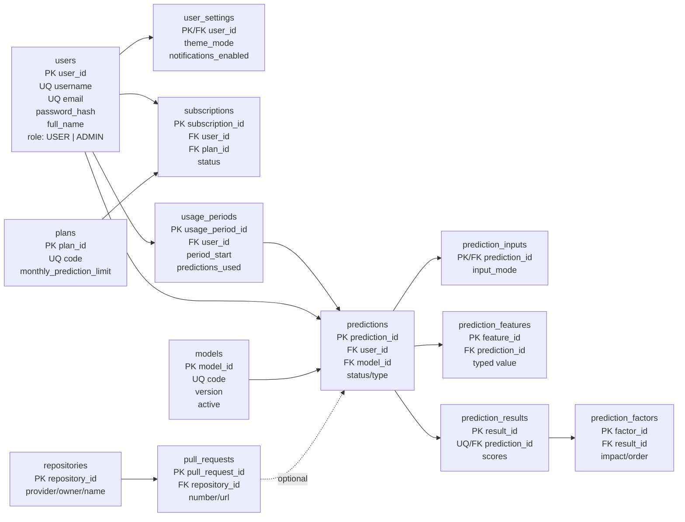

# Relational Schema Diagram

The running SQLite/MySQL schema is created by SQLAlchemy from `models.py`.

The `users.role` column is the admin option. It is constrained by application code to `USER` or `ADMIN`. Passwords are stored only as PBKDF2 hashes. A free plan has a numeric monthly limit of 5; Premium uses `NULL` for unlimited. History is a query over `predictions`, not a duplicate table.
